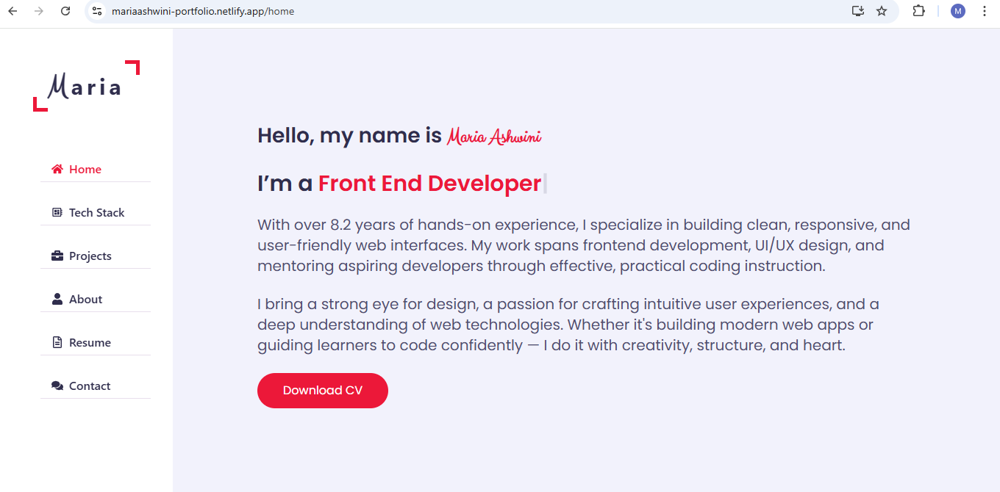

# Maria Ashwini - Developer Portfolio

A modern, responsive portfolio website built with **React** and **Tailwind CSS** to showcase my projects, skills, and experience as a full-stack developer.

🌐 **Live Site:** [https://mariaashwini-portfolio.netlify.app](https://mariaashwini-portfolio.netlify.app)  
📂 **GitHub Profile:** [https://github.com/mariaashwini/react-portfolio](https://github.com/mariaashwini/react-portfolio)

---

## ✨ Features
- **Responsive Design** – Optimized for mobile, tablet, and desktop
- **Project Showcase** – Live links and GitHub repositories for each project
- **About Me** – Skills, career journey, and background
- **Contact Section** – Easy way for recruiters to connect
- **Fast & Lightweight** – Built with performance in mind

---

## 🛠️ Tech Stack
- **Frontend:** React, Tailwind CSS
- **Hosting:** Netlify

---

## 📸 Preview

---

## 📬 Contact
- **Email:** mariaashwini06@gmail.com
- **LinkedIn:** [linkedin.com/in/mariaashwini](https://linkedin.com/in/mariaashwini)
- **GitHub:** [github.com/mariaashwini](https://github.com/mariaashwini)